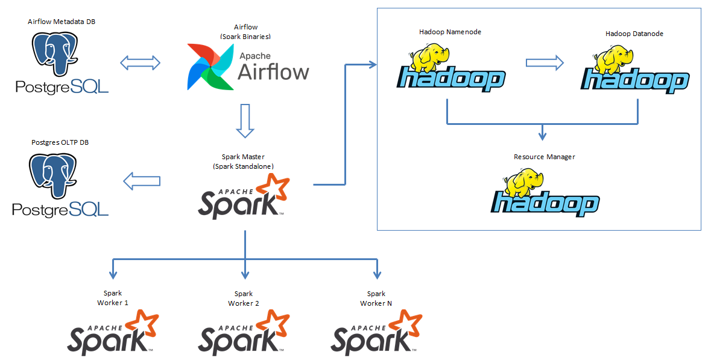
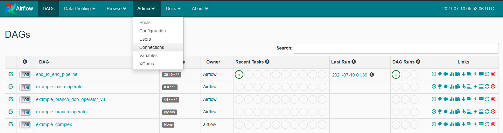
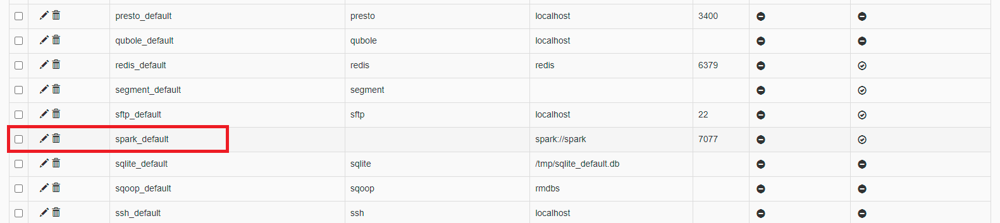
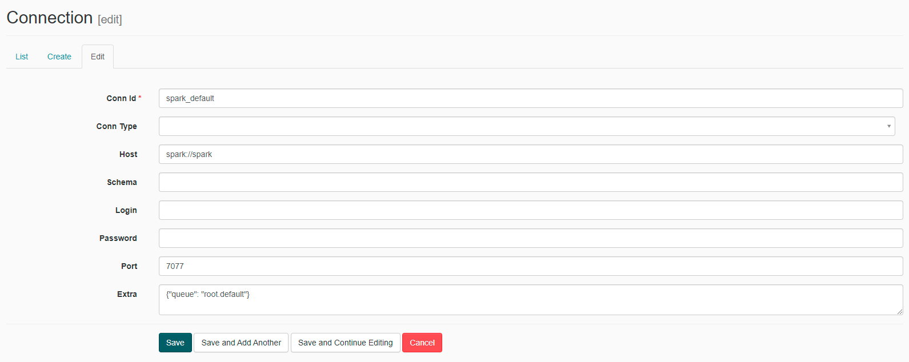
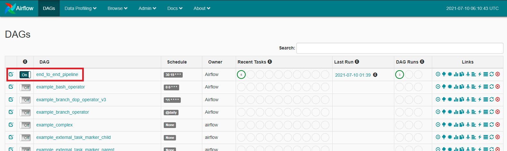
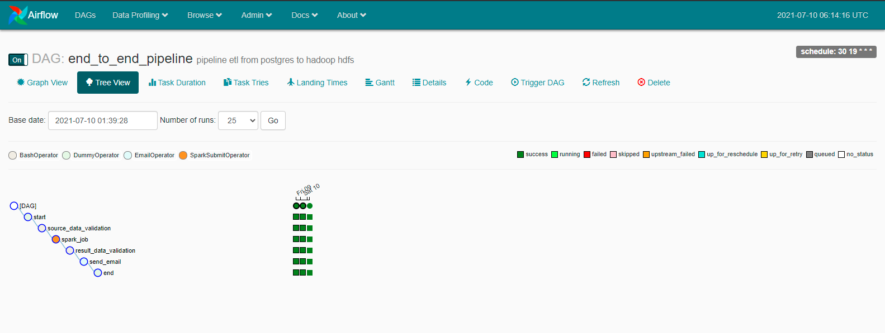
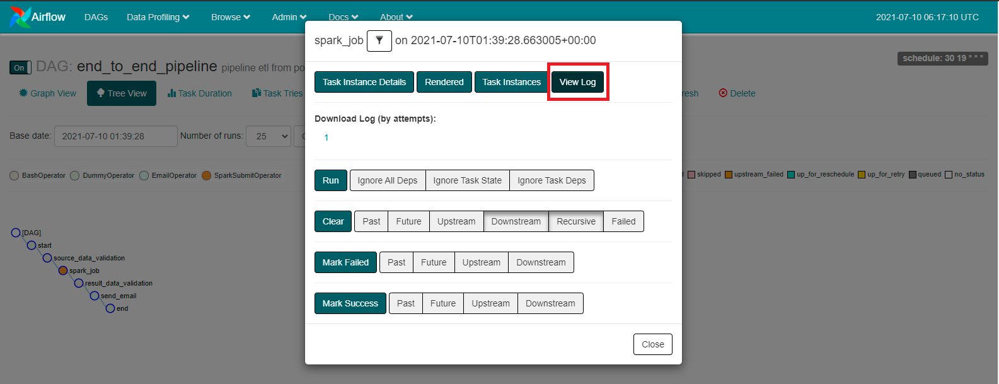
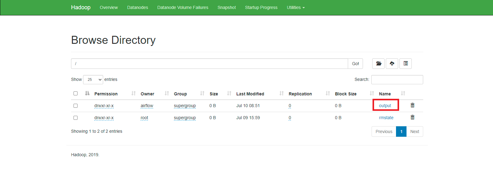

# Big Data Architecture & End to End ETL Pipeline

Project ini menggunakan beberapa referensi `image` atau `container` berikut:

* `postgres`: Postgres database menyimpan metadata Airflow & sebagai OLTP database.
    * Image: postgres:13.2
    * Database Port: 5432
    * References: https://hub.docker.com/_/postgres

* `airflow-webserver`: Airflow webserver and Scheduler ETL jobs.
    * Image: Dockerfile
    * Port: 8080
    * References: https://github.com/puckel/docker-airflow 

* `spark`: Spark Master.
    * Image: docker.io/bitnami/spark:3
    * Port: 8181
    * References: 
        * https://hub.docker.com/r/bitnami/spark 
        * https://github.com/bitnami/bitnami-docker-spark

* `spark-worker-N`: Spark Workers. Anda bisa menambahkan spark-worker di docker-compose file.
    * Image: docker.io/bitnami/spark:3
    * References: 
        * https://hub.docker.com/r/bitnami/spark 
        * https://github.com/bitnami/bitnami-docker-spark

* `hadoop`: Hadoop sebagai Data Lake & Data Warehouse.
    * Image: 
        * `docker-compose.yml`: teivah/hadoop:2.9.2
        * `docker-compose.yaml`: bde2020/hadoop
    * Port: 50070
    * References: 
        * https://hub.docker.com/r/teivah/hadoop
        * https://github.com/big-data-europe/docker-hadoop


### .
## Architecture Components




### .
## Requirements

- Docker
- Git (optional)


### .
## Set-up

### Clone project

Jika Anda `Windows User` maka atur configurasi git agar menggunakan Unix-style dengan command:
    
    $ git config --global core.autocrlf false

Clone repository ini dengan command:

    $ git clone https://github.com/arinannp/big-data-architecture.git


### Build image dependencies

Pindah ke working direktori /big-data-architecture

```Ada 2 docker-compose file untuk build & pull images, Anda bisa memilih salah satu```
    
- Jika menggunakan `docker-compose.yaml` dengan image bde2020/hadoop, jalankan command:
        
        $ docker-compose -f docker-compose.yaml build

- Jika menggunakan `docker-compose.yml` dengan image teivah/hadoop:2.9.2, jalankan command:
        
        $ docker-compose -f docker-compose.yml build


### Start containers

Untuk running containers, Anda bisa jalankan command berikut

- Jika Anda build images dengan file `docker-compose.yaml`, jalankan command:
        
        $ docker-compose -f docker-compose.yaml up -d

- Jika Anda build images dengan file `docker-compose.yml`, jalankan command:
        
        $ docker-compose -f docker-compose.yml up -d

Note: command -d digunakan agar running di background.


### Check containers logs

Anda bisa cek logs dari containers yang sudah di build, apakah containers/apps tersebut sudah ready

- Jika Anda build containers dengan file `docker-compose.yaml`, jalankan command:
        
        $ docker-compose -f docker-compose.yaml logs --tail 10

- Jika Anda build containers dengan file `docker-compose.yml`, jalankan command:
        
        $ docker-compose -f docker-compose.yml logs --tail 10

Note: command --tail 10 hanya menampilkan 10 logs terakhir.


### Access the containers/apps that were built

Airflow: http://localhost:8080

Postgres - Database Airflow:
* Server: localhost:5432
* Database: airflow
* User: airflow
* Password: airflow

Spark Master: http://localhost:8181

Hadoop Namenode: http://localhost:50070

Postgres - Database Transactional (OLTP):
* Server: localhost:5431
* Database: digitalskola
* User: digitalskola
* Password: digitalskola


### .
## How to Run an End to End Pipeline

1. Konfigurasi spark-connection melalui Airflow UI http://localhost:8080, klik Admin -> Connections
    

2. Cari `spark_default` connection dan klik Edit
    

3. Lakukan konfigurasi seperti gambar, dan klik Save:
    

4. Run end_to_end_pipeline DAG
    
   
5. Check Airflow DAG Tree View
    

6. Check Spark Task Id Logs 
    

7. Check apakah data sudah tersimpan di Hadoop HDFS UI http://localhost:50070
    


### .
## How to run the Spark Apps via spark-submit
Anda juga bisa menjalankan Spark Jobs secara manual melalui CLI, dengan command:
```
$ docker exec -it spark spark-submit --driver-class-path /usr/local/spark/connectors/postgresql-9.4.1207.jar --jars /usr/local/spark/connectors/postgresql-9.4.1207.jar /usr/local/spark/pipeline/etl_process.py
```

### .
## Source Code
- Main ETL spark code: 
- Source data validations code:
- Result data validation code:
- DAG code file:


### .
## Stops and Removes Containers, Networks & Volumes
Anda bisa menghapus container hasil dari `docker-compose up` dengan command berikut

- Jika Anda build containers dengan file `docker-compose.yaml`, jalankan command:
        
        $ docker-compose -f docker-compose.yaml down

- Jika Anda build containers dengan file `docker-compose.yml`, jalankan command:
        
        $ docker-compose -f docker-compose.yml down


### .
## References
* https://github.com/cordon-thiago/airflow-spark
* https://github.com/big-data-europe/docker-hadoop
* https://github.com/puckel/docker-airflow 
